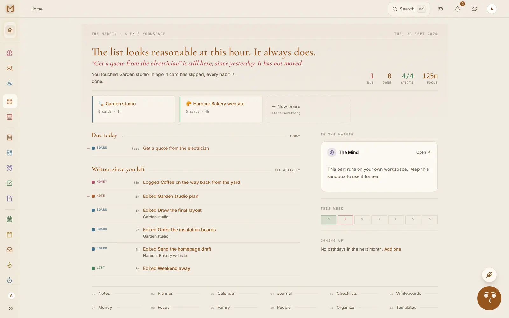

<p align="center">
  <a href="https://themarginapp.com"></a>
</p>

<h1 align="center">The Margin</h1>

<p align="center">
  One place for work, home and your own plans, that works offline and that your AI can use.
</p>

<p align="center">
  <a href="https://themarginapp.com">Website</a> ·
  <a href="https://themarginapp.com/try">Try it, no account</a> ·
  <a href="https://themarginapp.com/docs">Docs</a> ·
  <a href="https://themarginapp.com/changelog">Changelog</a> ·
  <a href="https://github.com/themarginapp/the-margin/discussions">Discussions</a>
</p>

<p align="center">
  
</p>

## What it is

The Margin keeps boards, notes, checklists, habits, money, meals, chores and chat in one app. A household or a team shares what it wants to share, and each person keeps a private side.

- **It works with no signal.** A full copy of your data lives on the device and catches up when it is back online.
- **It has an assistant built in.** Margin Intelligence can read across everything you keep there and act on it.
- **It works with the assistant you already use.** Claude, ChatGPT, Grok, Cursor and any other MCP client can connect to your workspace, and each thing they add is marked with who added it.
- **Your data is yours.** Export all of it whenever you like.

It runs in the browser and installs to a phone's home screen. Native apps for iPhone and Android are coming soon.

## Connect your AI

The server is at `https://mcp.themarginapp.com/mcp` and speaks MCP over Streamable HTTP. Sign-in is OAuth 2.1, so most clients only need the URL.

| Client | How |
|---|---|
| Claude | Settings → Connectors → Add custom connector, paste the URL |
| ChatGPT | Settings → Apps & Connectors → Create, paste the URL |
| Grok | Settings → Connectors → Add custom, paste the URL |
| Claude Code | `claude mcp add --transport http margin https://mcp.themarginapp.com/mcp` |
| Cursor and other JSON-config clients | See [`connector/examples`](connector/examples) |

Menu names move around between releases of each client. If one of these is out of date, [tell us](https://github.com/themarginapp/the-margin/issues/new/choose).

### Try it without an account

Point a client at `https://mcp.themarginapp.com/sandbox/mcp` with no credential. The server makes a demo household for that connection and deletes it about an hour after your last call.

```bash
claude mcp add --transport http margin-sandbox https://mcp.themarginapp.com/sandbox/mcp
```

### What an assistant can do

271 tools. 112 only read, 82 add or change, 77 can remove or overwrite. Every one is scoped to the person who signed in and the workspaces they chose.

The full list is in [`connector/TOOLS.md`](connector/TOOLS.md), with input schemas in [`connector/tools.json`](connector/tools.json). The guide is at [themarginapp.com/docs/agents-and-mcp](https://themarginapp.com/docs/agents-and-mcp).

## Report a problem or ask for something

- **Something is broken:** [open a bug report](https://github.com/themarginapp/the-margin/issues/new/choose).
- **You want something added:** [open a feature request](https://github.com/themarginapp/the-margin/issues/new/choose).
- **A question, or something to show:** [Discussions](https://github.com/themarginapp/the-margin/discussions).
- **A security problem:** please do not open an issue. See [SECURITY.md](SECURITY.md).
- **Your account or billing:** email [hello@themarginapp.com](mailto:hello@themarginapp.com). Please keep personal details out of public issues.

## What is in this repository

| Path | What |
|---|---|
| [`server.json`](server.json) | The MCP Registry entry |
| [`connector/`](connector) | The tool catalog, client configs and example prompts |
| [`ROADMAP.md`](ROADMAP.md) | What we are working on next |
| Issues and Discussions | Where bugs, requests and questions go |

The Margin's application code is not open source and is not in this repository. The files here are MIT licensed so you can copy the configs and examples freely.

---

<p align="center">Made by <a href="https://themarginapp.com">Meliura Ltd</a></p>
